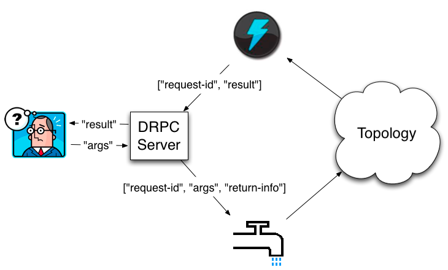

# DRPC(Distributed Remote Procedure Call)分布式远程调用



A client sends the DRPC server the name of the **function** to execute and the **arguments** to that function. The topology implementing that function uses a `DRPCSpout` to receive a function invocation stream from the DRPC server. __Each function invocation is tagged with a unique id  __by the DRPC server. The topology then computes the result and at the end of the topology a bolt called `ReturnResults` connects to the DRPC server and gives it the result for the function invocation id. The DRPC server then uses the id to match up that result with which client is waiting, unblocks the waiting client, and sends it the result.

## DRPC topologies type
- Linear DRPC topologies:
`LinearDRPCTopologyBuilder` at [org.apache.storm.drpc](https://github.com/apache/storm/tree/v1.1.0/storm-core/src/jvm/org/apache/storm/drpc)
- Non-linear DRPC topologies:
`CoordinatedBolt` at [org.apache.storm.coordination](https://github.com/apache/storm/tree/v1.1.0/storm-core/src/jvm/org/apache/storm/coordination)

## DRPC usage
1. Launching a DRPC server can be done with the storm script and is just like launching Nimbus or the UI:
``` bash
  bin/storm drpc
```
2. Configuring this through the `storm.yaml`:
```yaml
drpc.servers:
  - "drpc1.foo.com"
  - "drpc2.foo.com"
```
3. Launching DRPC topologies using StormSubmitter:
```java
StormSubmitter.submitTopology("exclamation-drpc", conf,
                                builder.createRemoteTopology());
```
See more in [Apache Storm DRPC](http://storm.apache.org/releases/1.1.0/Distributed-RPC.html)
