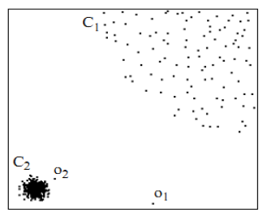
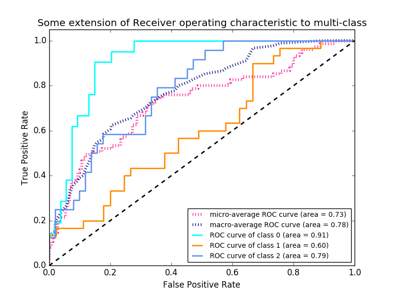

介绍无监督异常检测的方式, 数据集以及实验
描述其中的特征以及缺陷, 提供针对不同数据集时对算法在哪方面进行改进.
章节描述:
1. Introduction
2. Describes and discusses algorithms of this paper has choosen.
3. Introduce the evaluation measures and modifications.
4. datasets.
5. results of experiments.
6. summary.

# Intorduction
 - ‘distance-based’ outlier detection models.
 - effectiveness receives far less attention than efficiency.
   - 难于描述异常检测方法得到的异常.(导致不同方法在正确性上进行对比不太科学)
   - 缺乏对结果进行验证的方法.
   - 数据集缺少标签.

# Outlier detection methods
1.  a fixed distance threshold
2. assign to each object a score reflecting its ‘outlierness’
  1. kth-nearest neighbor
  2. k nearest neighbors
3. Local Outlier Factor (LOF)
  - reference set
    - all --> global
    - smaller --> local
  - 

## Methods
- ‘global’ methods
  - kNN
  - kNN-weight (kNNW)
  - ODIN (Outlier Detection using Indegree Number)
- 'local' methods
  - LOF (Local Outlier Factor)
  - SimplifiedLOF

# Evaluation measures
- P@n (Precision at $n$)
  - it is unclear how to fairly choose the parameter n.
- Adjusted P@n = $\frac{P@n - {|O|}/{N}} {1 - {|O|}/{N}}$
- average precision AP=$\frac{1}{|O|}\sum_{o \in O}{P@rank(o)}$
- Adjusted AP
- Receiver Operating Characteristic (ROC)
    - The curve is obtained by plotting for all possible choices of n the true positive rate versus the false positive rate.
    -  a perfect ranking (in which all outliers are ranked ahead of any inliers) would result in a curve consisting of a vertical line at false positive rate 0 and a horizontal line at the top of the plot.
    - 
